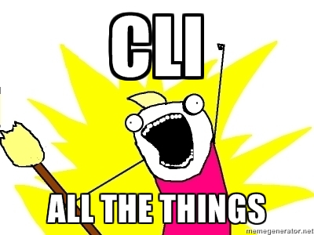
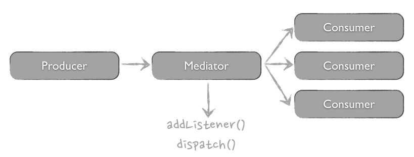

# Effectively using the Symfony components in Fork CMS.

---

## Hi, I'm Wouter


:twitter: [@WouterSioen](http://twitter.com/WouterSioen)

:github: [WouterSioen](http://github.com/WouterSioen)

---

## I work at Sumocoders

---


---

# I'm a Fork core developer

---

## Topics

* Routing
* DependencyInjection
* Console
* EventDispatcher
* Functional tests

---

## Topics we won't talk about

* Debug
* Filesystem
* Finder
* HttpFoundation
* HttpKernel
* Monolog
* Yaml

---

## Routing: Front controller


???

Symfony follows the Front Controller pattern. This means that all requests use one
central entry point. This one place makes sure the request is routed to the right
controller and returns the response. In symfony, there are in fact two front controllers:
web/app.php for normal requests and web/app_dev.php for requests in debug mode.

In Fork CMS, we only have 1 front controller: our index.php file.

---

## Routing: Front controller


???

The diagram in the previous slide was in fact an ultra simplified version of how
symfony sends the requests to the right controller. The handle() method is called
on the HttpKernel and the request is send to it as a parameter. This handle method
will dispatch the kernel.request event. (more about events later). There could be
multiple listeners to this event, but in most cases, it will be the "RouterListener"
that will send back the controller method.

---

## Routing: implementation

```yaml
# app/config/routing.yml
custom_application:
    path:/custom/application
    defaults:
        _controller: /Custom/Controller::helloWorldAction
```

???

All our routes are (for now) saved in the app/config/routing.yml file. You can
just add an extra entry in there with a name, a path and a controller. When the
given route is matched, the given controller will be responsible to send back the
response. The name is used to generate url's to this route.

Note that the order of the entries in this routing.yml file is important. The routing
component will check the routes until a matching route is found. Routes that are
further in the document, but also match the given url won't even be considered.

---

## Routing: implementation

```php
// Custom/Controller.php
namespace Custom;

use Symfony\Component\HttpFoundation\Request;
use Symfony\Component\HttpFoundation\Response;

class Controller
{
    public function helloWorldAction(Request $request)
    {
        return new Response('Hello world');
    }
}
```

???

To make your controller work, you have to add the controller method specified in
your routing.yml file. Even though the static notation is used in the yaml file,
your method should not be static. An instance of the Controller class will be made
and the parameters will be injected. If a parameter typehinted as a Request is available
(like in the example), the request object will be inserted.

every controller should return a Response. This will be bubbled up to the Front
Controller and send to the user.

---

## Routing: parameters

```yaml
# app/config/routing.yml
custom_application:
    path:/custom/application/{page}
    defaults:
        _controller: /Custom/Controller::helloWorldAction
        page: 1
    requirements:
        page: d\+
```

???

You can add parameters to your routes to make it a lot more dynamic. The preview
shows a page number as argument, but this could be a slug, an id, ...

You can also add requirements and defaults to these parameters. Requirements will
make sure the route can only be matched when the parameters follow a certain regex.
In this case, only numbers will match, because we can only interpret these as page
numbers.

We've given the page as default number "1". This makes it easy to make parameters
not required.

---

## Routing: parameters

```php
// Custom/Controller.php
namespace Custom;

use Symfony\Component\HttpFoundation\Request;
use Symfony\Component\HttpFoundation\Response;

class Controller
{
    public function helloWorldAction(Request $request, $id)
    {
        return new Response('Hello world: page' . $id);
    }
}
```

???

The parameter will be injected in your method. Note that the matching is done on
variable name. The order is not relevant. You can also change the request to not
be the first parameter.

---

## Service container

> Put simply, a Service is any PHP object that performs some sort of "global" task.
>
> -- Fabien Potencier

---

## DIC: Dependency injection

> Dependency injection is a _design pattern_ to achieve dependency inversion.

---

## DIC: Dependency injection

```php
// without dependency injection
class Database
{
    private $logger;

    public function __construct()
    {
        $this->logger = new Logger();
    }
}
```

???

Let's first look at what dependency injection is. The class in this example creates
a new instance of the Logger class, each time a class instance is created. This
logger is (hopefully) used later in this class, so we can say the Logger is a
dependency of the Database class

---

## DIC: Dependency injection

```php
// with dependency injection
class Database
{
    private $logger;

    public function __construct(Logger $logger)
    {
        $this->logger = $logger;
    }
}
```

???

In this example, the Logger is still a dependency of the logger. The only change
is that it's injected in the class, instead of instantiated there. The dependencies
could also be injected using setter injection.

We want to do this to decouple our classes from it's dependencies. If you've been
paying attention, you've probably be noticed that our example isn't that less
decoupled than our previous version. That's where the dependency inversion principle
comes in.

---

## DIC: Dependency inversion

SOLID principles

* Single responsibility
* Open-Closed
* Liskov Substitution
* Interface Segregation
* __Dependency inversion__

???

The SOLID principles are five basic principles of OO programming and design. They
were introduced by Robert C. Martin and will help you to build maintainable code.

---

## DIC: Dependency inversion

> High-level modules should not depend on low-level modules. Both should depend on abstractions.

<!-- -->

> Abstractions should not depend on details. Details should depend on abstractions.
>
> -- Robert C. Martin

???

The Dependency inversion principle contains two statements. (See slide). In our
example, it's pretty easy to get this straight.

---

## DIC: dependency inversion

```php
class MySqlDatabase implements DatabaseInterface
{
    protected $logger;

    public function __construct(LoggerInterface $logger)
    {
        $this->logger = $logger;
    }

    public function insert($data)
    {
        // execute the query

        $this->logger->info(
            'query executed',
            array($query, $parameters)
        );
    }
}
```

???

As you can see, we introduced interfaces! Our Database can now accept every type
of logger, as long as it implements the LoggerInterface. This means that we depend
on abstractions, not on implementations, as the dependency inversion principle
states. Our Database class is decoupled from the logger!

I also renamed "Database" to "MySqlDatabase" and made it implement the
DatabaseInterface. This way, I can swap our database with a postgress implementation
without a lot of hassle, as long as it implements the DatabaseInterface, we're
ready to go!

---

## Dependency inversion principle

Would you solder a lamp directly to the electrial wiring in a wall?

---

## DIC: Service container

> A Service Container (or dependency injection container) is simply a PHP object that manages the instantiation of services (i.e. objects).
>
> -- Fabien Potencier

???

Symfony used a "Service Container" or "Dependency injection container" to manage
all these services. Using this service container, we can easily manage all the
reusable classes and the dependencies they get injected. But enough theory, let's
look at how this works.

---

## DIC: what's in there?

```bash
# List all services
app/console container:debug
```

```bash
# I know what I'm looking for
app/console container:debug | ack mailer
```

???

There are already a lot of services in this container by default, mostly added
by Symfony. Fork provides the custom database service. Using the container:debug
command, you can easily see what's in there. But there's a lot in there, so it
could be easier to use grep or ack to fastly filter what you're looking for.

---

## DIC: adding a service

```php
namespace Common;

class Paginator
{
    public function paginate(array $items, $page = 1, $limit = 10)
    {
        return array_slice(
            $items,
            ($page - 1) * $limit,
            $limit
        );
    }
}
```

???

Implementing a service is really easy. The first step is to create a PHP class
that implements some functionality. In this example, I'll create the most simple
pagination system possible. Our service (which is in fact just a PHP class),
we'll receive an array and possibly a page and a limit. We return a slice of the
array.

---

## DIC: adding a service

```yaml
# app/config/routing.yml
services:
    paginator:
        class: Common\Paginator
        arguments: [ "@logger" ]
```

???

We now have our service, but we wan't it to be available in our dependency
injection container. Adding a service is as easy as adding some lines in the
configuration file of Fork (or Symfony). We need to give the service a name and
specify the class. It's also possible to add arguments (for constructor
injection) or to add calls, to do setter injection or call some "startup"
method on your service. On the database service, there are calls added, to force
the database to use the utf-8 charset.

---

## DIC: using your service

```php
// src/Frontend/Blog/Actions/Index.php
$this->tpl->assign(
    'pagination',
    $this->get('paginator')->paginate($blogPosts)
);
```

???

We can now fetch our service from the dependency injection container! It's as
easy as calling the $this->get shortcut in a method, or using the Model::get
shortcuts in our static classes.

---

## DIC: more configuration

Using a factory

```yaml
# app/config/routing.yml
services:
    faker:
        class: Faker\Generator
        factory_class: Faker\Factory
        factory_method: create
        arguments: [ 'en_US' ]
```

???

Some code requires a factory method to be called to create the instance. You can
see an example of creating a generator for faker (which is awesome btw) using
the Faker\Factory. The factory_class and factory_method should be specified to
use this.

---

## Console

Used by

* Composer
* Behat
* phpspec
* ...



???

The Symfony console component is one of the components you'll find most out of
the Symfony ecosystem. Some tools you're probably use everyday are based on it.

---

## Console: some commands

```bash
# list all commands
app/console

# start a php server that users the current folder as docroot
app/console server:run --docroot=.

# list all services in the DIC
app/console container:debug

# list all loaded routes
app/console router:debug
```

???

There are already a lot of commands available in Fork at the moment. You can see
all possible commands when you type in app/console without stating a command.

---

## Console: implementation

```php
// Common/Command/HelloWorldCommand.php
namespace Common\Command;

use Symfony\Component\Console\Command\Command;
use Symfony\Component\Console\Input\InputInterface;
use Symfony\Component\Console\Output\OutputInterface;

class HelloWorldCommand extends Command
{
    protected function configure()
    {
        $this->setName('hello:world')
            ->setDescription('Say hello to the world');
    }

    protected function execute(InputInterface $input, OutputInterface $output)
    {
        $output->writeln('Hello meetup!');
    }
}
```

???

Implementing a console command is not that hard. In the php file, you have two
methods. The configure method describes your command and will be used for
documentation about your command and to validate the input. Arguments and options
should be specified in there.

The execute method is called when you run app/console suffixed with the name of
your command. It's good to know that you can abbreviate your name, as long as
it's stays unique. You can for example use h:w if that's unique.

When you need services from the DIC, you can also implement the
ContainerAwareCommand interface. Symfony will automatically inject the container
into the command and you'll be able to fetch it using $this->getContainer().

---

## Console: implementation

```php
// app/console
$application = new Application($kernel);
$application->add(new \Common\Command\HelloWorldCommand());
$application->run($input);
```

???

All available commands are registered in an application. When your command is in
the right namespace in a Symfony bundle, it will be automatically registered.
When adding a command in a Fork module, you have to register it manually though.

You can do it by just adding an instance of it to the application object.

---

## Console: other stuff

* Options & arguments
* Helpers
  * Question
  * Formatter
  * Progress bar
  * Table
* Coloring output
* Verbosity

???

The functionaly I showed is of course not enough to write amazing stuff (like
composer) using this component. The component contains a large amount of
features and helper sets to make it easy for you to implement most CLI features.

---

## Event dispatcher

Easy to hook into other modules without coupling.

* Now: remove search module => backend breaks.
* Using events: remove module => search indices not saved

???

The event dispatcher is a really nice component that makes it easy to decouple
code. There is already an open PR to Fork CMS to start reworking some stuff
using the event dispatcher. A common thing to do in these kind of events is
sending notification emails. It's really useful to have low coupling between
modular code.

---

## Event dispatcher: theory



???

The event dispatcher implements the mediator pattern. This pattern introduces an
object that handles all communication between other objects: the producers
(= objects that throws events) and the consumers (=subscribers/listeners).

---

## Events: Implementation

```php
namespace Backend\Modules\Blog;

final class BlogEvents
{
    /**
     * The blog.post_saved event is thrown each time a
     * blog post is submitted.
     *
     * The event listener receives an
     * Backend\Modules\Blog\Event\PostSavedEvent instance.
     *
     * @var string
     */
    const POST_SAVED = 'blog.post_saved';
}
```

???

Using the events system requires a little more effort then the previous components
we've used. We can start by creating an overview of all events in a module/bundle.
This is optional, but it can be helpful to be able to use the constants which is
less error prone, and to have an overview in one place.

---

## Events: Implementation

```php
namespace Backend\Modules\Blog\Event;

use Symfony\Component\EventDispatcher\Event;

class PostSavedEvent extends Event
{
    protected $post;

    public function __construct($post)
    {
        $this->post = $post;
    }

    public function getPost()
    {
        return $this->post;
    }
}
```

???

In the second step, we create an "event" object. this is the object that will be
passed between the producer, the mediator and the consumer. This means that all
data in here will be set when dispatching the event. It will also be the data our
subscriber will get and will be able to use.

---

## Events: Implementation

```php
namespace Backend\Modules\Search\EventListener;

use Backend\Modules\Blog\Event\PostAddedEvent;
use Backend\Modules\Search\Engine\Model as SearchModel;

class SearchIndexListener {
    protected $module;

    public function __construct($module) {
        $this->module = $module;
    }

    public function onPostSaved(PostAddedEvent $event) {
        $post = $event->getPost();
        SearchModel::saveIndex(
            $this->module,
            $post['id'],
            [ 'title' => $post['title'], 'text' => $post['text'] ]
        );
    }
}
```

???

Our event subscriber or listener is in fact just a service. You can inject other
services in it using dependency injection, as seen in one of the previous examples.

It should have a method that will be called when the event is dispatched. This
method receives our event object.

---

## Events: Implementation

```yaml
services:
    blog.search_indexer:
        class: ...\EventListener\BlogPostSearchIndexListener
        arguments:
            - "Blog"
        tags:
            -
                name: kernel.event_listener
                event: blog.post_saved
                method: onPostSaved
```

???

We now have our listener, but we should still link our subscriber to the event.
We can register the class as a service first, to make it available in the container.

Changing a service into an event listener is done by using tags. We add the tag
with the name "kernel.event_listener" to it. This makes sue our container knows
that this service should be registered in the mediator.

We also add the event (from the event overview class) and the method that should
be called in here.

---

## Events: Implementation

```php
$this->get('event_dispatcher')->dispatch(
    BlogEvents::POST_SAVED,
    new PostSavedEvent($post)
);
```

???

Everything is set up! We're now ready to dispatch our event! All event subscribers
will be called automatically.

---

## Functional tests

* refactorings: make sure nothing breaks
* confidence in code
* $maintainability++

???

We have functional tests in Fork for around one month now and they have already
proven to be very helpful. We were able to spot some problems in our code and
pull requests just became a lot easier to inspect.

Functional tests are really useful when refactoring. You can change everything
on the inside of your application, but you'll know you're application is still
running without having to manually run trough all pages. Having green tests
is also a great mental help. It gives you confidence in your code. You can deploy
your code to production and be sure that (the tested parts) won't be broken.

---

## Tests: Implementation

```php
namespace Backend\Modules\Events\DataFixtures;

class LoadEvents
{
    public function load(\SpoonDatabase $database)
    {
        $metaId = $database->insert(
            'meta',
            array('url' => 'event-for-functional-tests')
        );

        $database->insert(
            'events',
            array(
                'language'   => 'en',
                'meta_id'    => $metaId,
                'title'      => 'Event for functional tests',
                'start_date' => '2015-03-26',
                'start_hour' => '19:00,
            )
        );
    }
}
```

???

To use functional tests, we need some data. If we want to check if a blog works,
we need posts, categories, comments,... to check.

The way we load data is using fixtures. This concept also exists in Symfony, using
the doctrine library, but since we're still tied to SpoonDatabase, we have our
own custom implementation. It's as easy as creating a class with a load method
that accepts a SpoonDatabase instance. You can then do queries on the database
to insert your wanted data.

---

## Tests: Implementation

```php
namespace Frontend\Modules\Events\Tests\Actions;

class IndexText extends \Common\WebTestCase
{
    public function testIndexContainsEvents()
    {
        $client = static::createClient();
        $this->loadFixtures(
            $client,
            ['Backend\Modules\Events\DataFixtures\LoadEvents']
        );

        $client->request('GET', '/en/events');
        $this->assertEquals(
            200,
            $client->getResponse()->getStatusCode()
        );
        $this->assertContains(
            'Event for functional tests',
            $client->getResponse()->getContent()
        );
    }
}
```

???

A functional test itself extends the \Common\WebTestCase class. This is a base
class that extends Symfony's WebTestCase to provide some Fork specific stuff.

It contains for example some hacks to put data in the $_GET and $_POST superglobals
to make sure SpoonForms can be submitted.

The first step in our testmethod itself is creating a client. This is an instance
of Symfonys test client. This client is in fact a headless version of your Symfony
application. It will find the AppKernel, the heart of our application, and do
requests on it, as if it was a browser, or other HTTP-client.

After creating the client, we can load the fixtures. When loading fixtures, our
database will always be reset to a clean state (default Fork installation). The
load method in t he classes given as the second argument will be called afterwards
to provide custom data for the test.

After setting everything up, we can do requests on the client. In this example,
we do a request to the index page and check if we get a 200 response and if our
event - added in the fixture - is available on this page.

---

## Tests: Implementation

```php
namespace Frontend\Modules\Events\Tests\Actions;

use Common\WebTestCase;

class IndexText extends WebTestCase
{
    public function testNonExistingPageGives404()
    {
        $client = static::createClient();

        $client->request(
            'GET',
            '/en/events',
            array('page' => 34)
        );

        $this->assertIs404($client);
    }
}
```

???

It's also a good idea to not only test the succesful scenarios. You should for
example get a 404 when you go to the 34th event index page when there is only one
event, or when you go to the event detail page with a wrong slug.

We added a nice assertIs404 method that will check if we're redirect to the 404
page and if we got the 404 status code.

---

## Tests: Running them

```bash
# running all the tests
bin/phpunit -c app

# running one test suite
bin/phpunit -c app --testsuite=unit
bin/phpunit -c app --testsuite=functional

# using a filter
bin/phpunit -c app --filter=event
```

???

When creating tests, or writing code that is tested, it's important to run the
tests a lot. With functional tests, your tests can get slow, so you can also filter
on a string, or run only the unit or the functional tests.

After deploying a feature, it could be useful to run the full testsuite again.
When proposing features to Fork, this will also be done on travis-ci, to make
sure our code still works on various php versions.

---

## Tests: Useful assertions

```php
// assert url after redirect (clicking a link/submitting a form)
$this->assertStringEndsWith(
    '/en/events/detail/event-for-functional-tests',
    $client->getHistory()->current()->getUri()
);
```

```php
// test that the page title contains some words
$this->assertStringStartsWith(
    'Event for functional tests',
    $crawler->filter('title')->text()
);
```

```php
// assert that the page does not contain (have 0 occurences) of
$this->assertEquals(
    0,
    $crawler
        ->filter('html:contains("Event for functional tests")')
        ->count()
);
```

???

Phpunit provides a lot of assertions which are all listed in it's documentation.
You won't need them all though. This list contains some assertions you'll need
a lot in functional tests.

---

## Questions?

---

## Thank you!

<https://joind.in/talk/view/14182>

---

## Resources

http://symfony.com/doc/current/index.html
https://speakerdeck.com/ronnylt/dic-to-the-limit-desymfonyday-barcelona-2014
